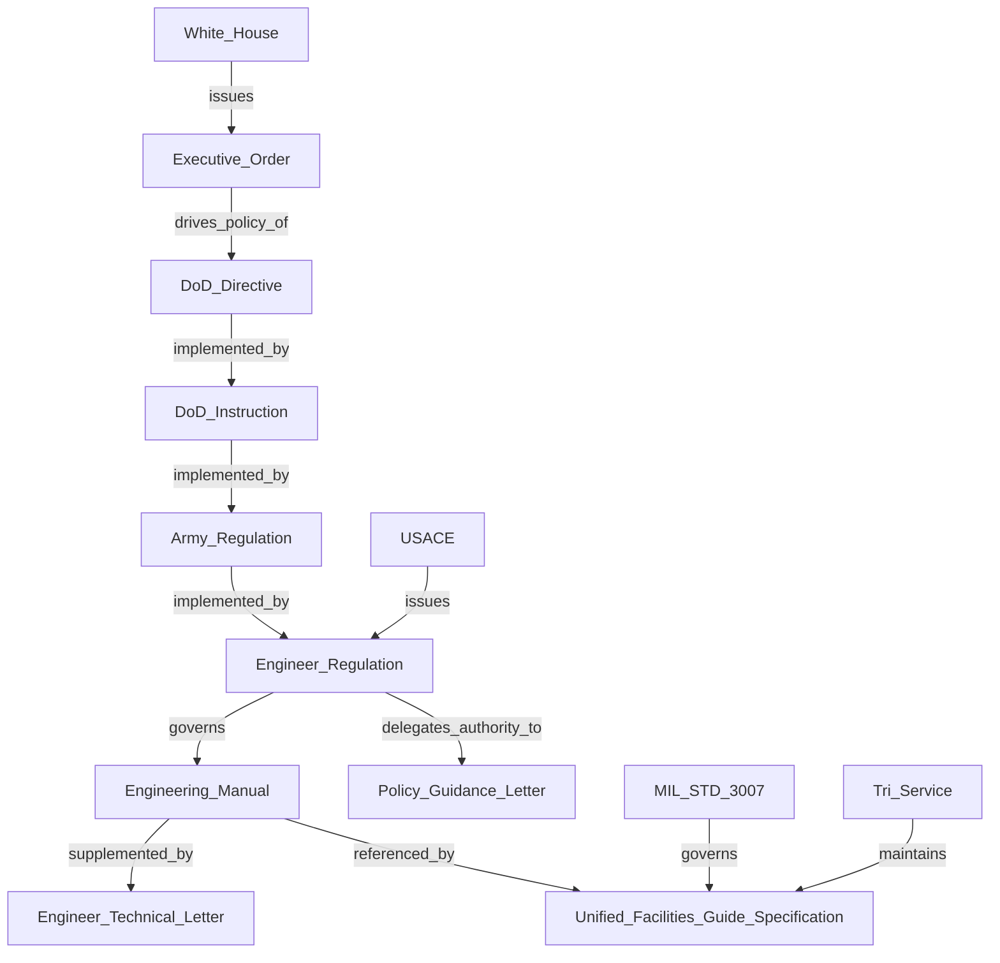

# Federal Facility Document Hierarchy Knowledge Graph

This repository models the hierarchy and relationships between key federal facility policy, standards, and criteria documents, including:
- Executive Orders (EO)
- DoD Directives (DoDD) & Instructions (DoDI)
- Army Regulations (AR)
- USACE Engineering Publications (ER, EM, EP, etc.)
- MIL-STD-3007G, Unified Facilities Criteria (UFC), and Guide Specifications (UFGS)
- Operational Documents (OPORDs, FRAGOs, WARNOs, etc.)

## 🔄 File Formats
- `document_hierarchy_with_org.csv`: Flat table of subject → predicate → object with department info
- `document_hierarchy_with_org.ttl`: RDF Turtle format for semantic web tools
- `document_hierarchy_with_org.jsonld`: JSON-LD format for linked data applications
- `document_hierarchy_mermaid.md`: Diagram definition file for copy/paste into markdown

## 📊 Graph Visualization
A simplified diagram illustrating core relationships is embedded below:

➡️ [View full diagram](./document_hierarchy_mermaid.md)

## 🧠 Use Cases
- Power knowledge-graph-based RAG pipelines (e.g., LangChain, LlamaIndex)
- Visualize document dependencies in compliance workflows
- Link structured metadata to full-text document embeddings

## 📦 Integration Uses
- Neo4j via `LOAD CSV` or `RDF` plugins
- SPARQL queries via GraphDB or Blazegraph
- LangChain `KnowledgeGraphRetriever` or `GraphIndex`

## 📄 Source References
- [MIL-STD-3007G (WBDG)](https://www.wbdg.org/FFC/FEDMIL/milstd3007g.pdf)
- [Unified Facilities Criteria](https://www.wbdg.org/ffc/dod/unified-facilities-criteria-ufc)
- [Unified Facilities Guide Specifications](https://www.wbdg.org/ffc/dod/unified-facilities-guide-specifications-ufgs)

## License
Public domain
