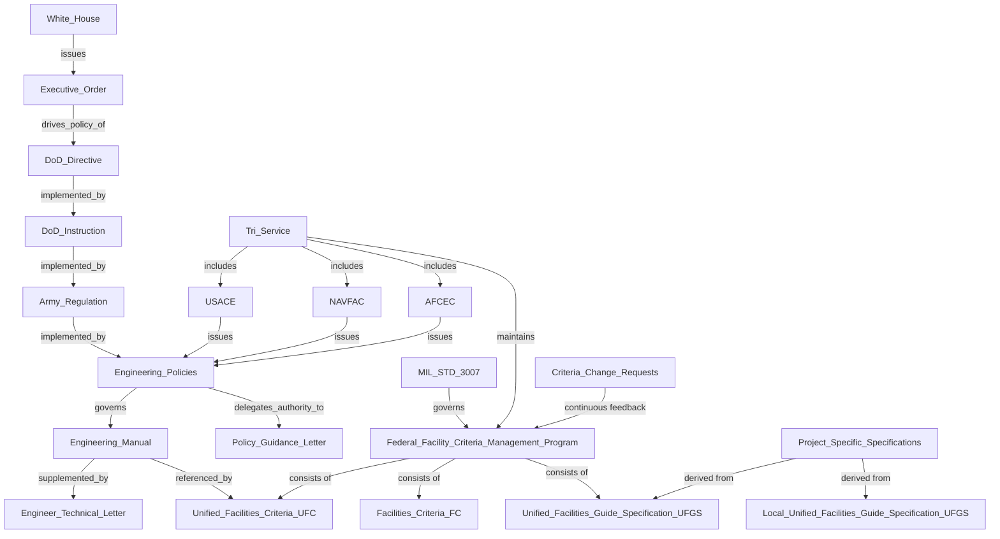

```mermaid
graph TD
  White_House -->|issues| Executive_Order
  Executive_Order -->|drives_policy_of| DoD_Directive
  DoD_Directive -->|implemented_by| DoD_Instruction
  DoD_Instruction -->|implemented_by| Army_Regulation
  Army_Regulation -->|implemented_by| Engineering_Policies
  Engineering_Policies -->|governs| Engineering_Manual
  Engineering_Manual -->|supplemented_by| Engineer_Technical_Letter
  Engineering_Policies -->|delegates_authority_to| Policy_Guidance_Letter
  Engineering_Manual -->|referenced_by| Unified_Facilities_Criteria_UFC
  MIL_STD_3007 -->|governs| Federal_Facility_Criteria_Management_Program
  Tri_Service -->|includes| USACE
  Tri_Service -->|includes| NAVFAC
  Tri_Service -->|includes| AFCEC
  USACE -->|issues| Engineering_Policies
  NAVFAC -->|issues| Engineering_Policies
  AFCEC -->|issues| Engineering_Policies
  Tri_Service -->|maintains| Federal_Facility_Criteria_Management_Program
  Criteria_Change_Requests -->|continuous feedback| Federal_Facility_Criteria_Management_Program
  Federal_Facility_Criteria_Management_Program -->|consists of| Unified_Facilities_Criteria_UFC
  Federal_Facility_Criteria_Management_Program -->|consists of| Facilities_Criteria_FC
  Federal_Facility_Criteria_Management_Program -->|consists of| Unified_Facilities_Guide_Specification_UFGS
  Project_Specific_Specifications --> |derived from| Unified_Facilities_Guide_Specification_UFGS
  Project_Specific_Specifications --> |derived from| Local_Unified_Facilities_Guide_Specification_UFGS
```
