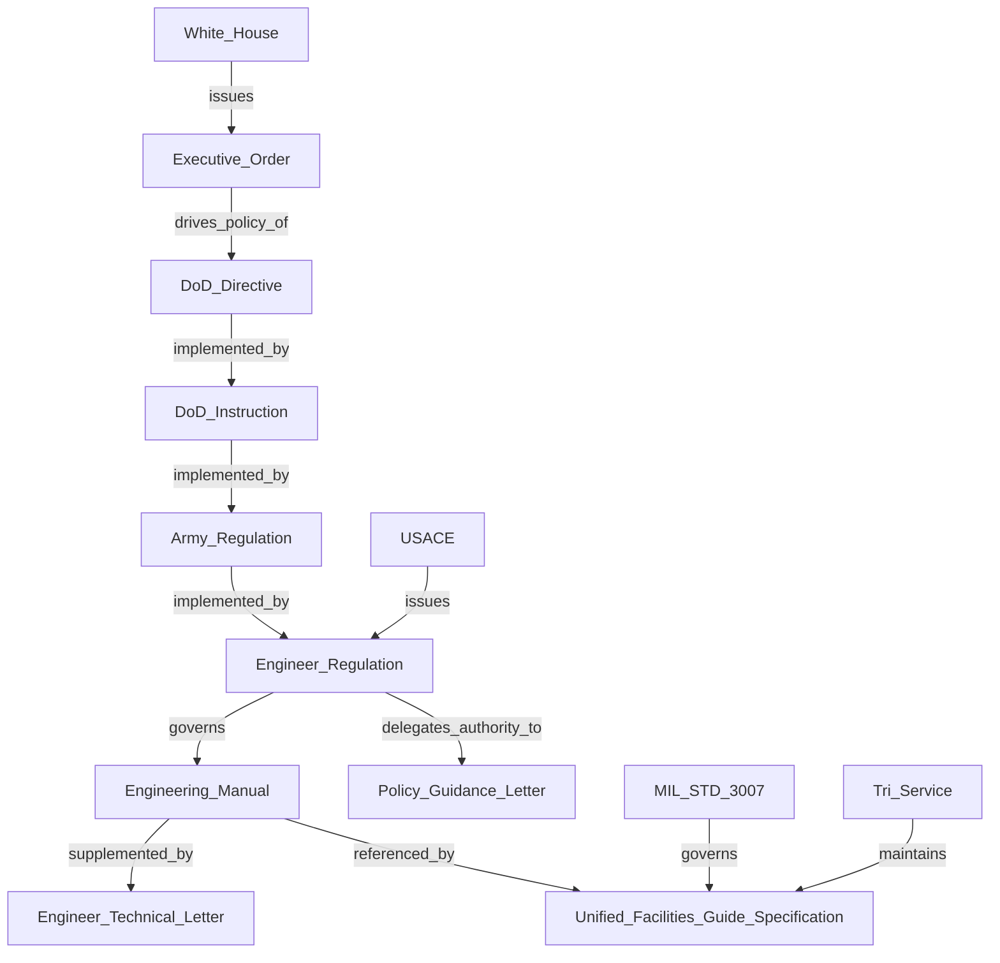

```mermaid
graph TD
  White_House -->|issues| Executive_Order
  Executive_Order -->|drives_policy_of| DoD_Directive
  DoD_Directive -->|implemented_by| DoD_Instruction
  DoD_Instruction -->|implemented_by| Army_Regulation
  Army_Regulation -->|implemented_by| Engineer_Regulation
  Engineer_Regulation -->|governs| Engineering_Manual
  Engineering_Manual -->|supplemented_by| Engineer_Technical_Letter
  Engineer_Regulation -->|delegates_authority_to| Policy_Guidance_Letter
  Engineering_Manual -->|referenced_by| Unified_Facilities_Guide_Specification
  MIL_STD_3007 -->|governs| Unified_Facilities_Guide_Specification
  USACE -->|issues| Engineer_Regulation
  Tri_Service -->|maintains| Unified_Facilities_Guide_Specification
```